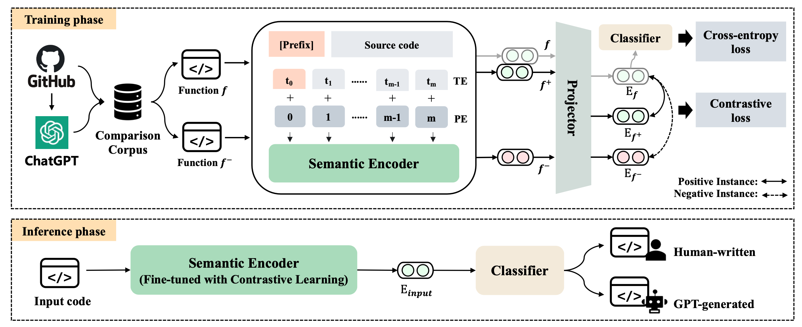

# CodeGPTSensor
This repository is for the paper titled "*Distinguishing LLM-generated from Human-written Code by Contrastive Learning*".

<div align="center">

<p> Fig. 1. The framework of CodeGPTSensor </p> 
</div>

### Project Structure
``` bash
├── CodeGPTSensor       # Implementation of CodeGPTSensor
|	├── models_output 	# Models will be saved here
|	├── utils           # Code for early stopping
|	├── model.py        # Code for our model
|	└── run.py          # Code for training and evaluation
└── dataset.zip         # The Java and Python train/valid/test datasets of ".jsonl" files
```

### Implementation of CodeGPTSensor
To train CodeGPTSensor, run the following command:
```
CUDA_VISIBLE_DEVICES=0 python run.py \
    --do_train \
    --model_name_or_path microsoft/unixcoder-base-nine \
    --train_data_file ../dataset/java/train.jsonl \
    --eval_data_file ../dataset/java/valid.jsonl \
    --output_dir models_output/java \
    --num_train_epochs 20 \
    --block_size 400 \
    --train_batch_size 8 \
    --eval_batch_size 16 \
    --learning_rate 2e-5 \
    --max_grad_norm 1.0 \
    --seed 99 \
    --contrast
```

To test CodeGPTSensor, run the following command:
```
CUDA_VISIBLE_DEVICES=0 python run.py \
    --do_test \
    --model_name_or_path microsoft/unixcoder-base-nine \
    --output_dir models_output/java \
    --test_data_file ../dataset/java/test.jsonl \
    --block_size 400 \
    --eval_batch_size 16 \
    --seed 99
```

**Notes:**
- Replace "train.jsonl" with "train_no_comment.jsonl" for the without comment datasets.
- Replace "java" with "python" for the Python datasets.